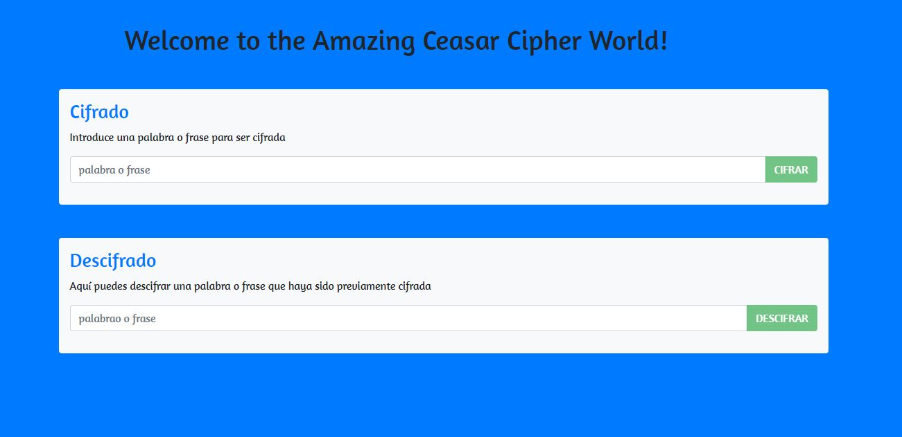

# Ceasar Cipher v. EC6

* En este repositorio presentamos una versión refactorizada del [repositorio del Cifrado Cesar](https://github.com/lucerohospina/cifradocesar) realizado anteriormente.

* Se plantea implementar las nuevas especificaciones del _**Ecma Script 6**_.

* Esta es la vista general del proyecto:

* Se implementó también el framework _bootstrap 4_.

#### En desarrollo por: _Lucero Hospina_